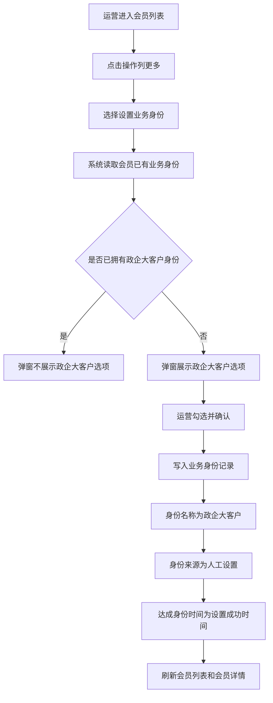
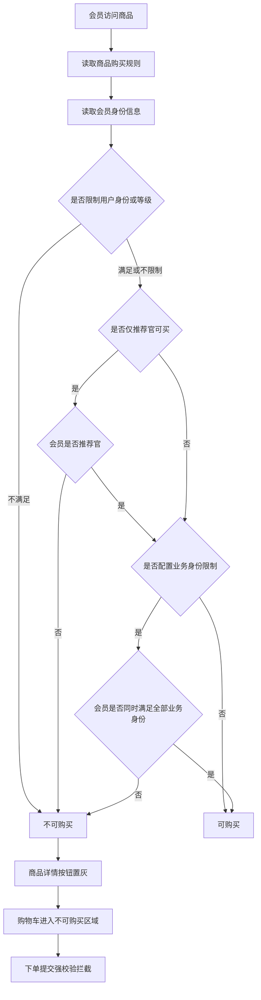
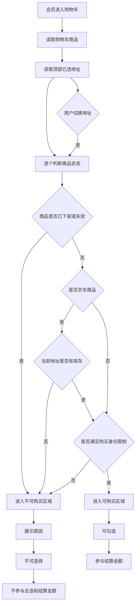
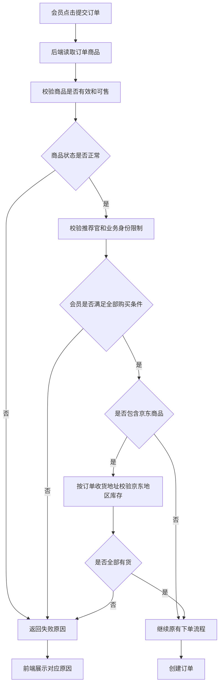

# 会员商城购物车&商品购买规则优化2606｜流程图

## 1. 人工设置业务身份流程

```mermaid
flowchart TD
  A[运营进入会员列表] --> B[点击操作列更多]
  B --> C[选择设置业务身份]
  C --> D[系统读取会员已有业务身份]
  D --> E{是否已拥有政企大客户身份}
  E -- 是 --> F[弹窗不展示政企大客户选项]
  E -- 否 --> G[弹窗展示政企大客户选项]
  G --> H[运营勾选并确认]
  H --> I[写入业务身份记录]
  I --> J[身份名称为政企大客户]
  J --> K[身份来源为人工设置]
  K --> L[达成身份时间为设置成功时间]
  L --> M[刷新会员列表和会员详情]
```

## 2. 商品购买资格校验流程

```mermaid
flowchart TD
  A[会员访问商品] --> B[读取商品购买规则]
  B --> C[读取会员身份信息]
  C --> D{是否限制用户身份或等级}
  D -- 不满足 --> X[不可购买]
  D -- 满足或不限制 --> E{是否仅推荐官可买}
  E -- 是 --> F{会员是否推荐官}
  F -- 否 --> X
  F -- 是 --> G{是否配置业务身份限制}
  E -- 否 --> G
  G -- 否 --> Y[可购买]
  G -- 是 --> H{会员是否同时满足全部业务身份}
  H -- 是 --> Y
  H -- 否 --> X
  X --> X1[商品详情按钮置灰]
  X1 --> X2[购物车进入不可购买区域]
  X2 --> X3[下单提交强校验拦截]
```

## 3. 购物车京东库存与不可购买分区流程

```mermaid
flowchart TD
  A[会员进入购物车] --> B[读取购物车商品]
  B --> C[读取顶部已选地址]
  C --> D[逐个判断商品状态]
  D --> E{商品是否已下架或失效}
  E -- 是 --> U[进入不可购买区域]
  E -- 否 --> F{是否京东商品}
  F -- 是 --> G{当前地址是否有库存}
  G -- 否 --> U
  G -- 是 --> H{是否满足购买身份限制}
  F -- 否 --> H
  H -- 否 --> U
  H -- 是 --> V[进入可购买区域]
  U --> U1[展示原因]
  U1 --> U2[不可选择]
  U2 --> U3[不参与全选和结算金额]
  V --> V1[可勾选]
  V1 --> V2[参与结算金额]
  C --> Z{用户切换地址}
  Z -- 是 --> D
```

## 4. 下单提交强校验流程

```mermaid
flowchart TD
  A[会员点击提交订单] --> B[后端读取订单商品]
  B --> C[校验商品是否有效和可售]
  C --> D{商品状态是否正常}
  D -- 否 --> X[返回失败原因]
  D -- 是 --> E[校验推荐官和业务身份限制]
  E --> F{会员是否满足全部购买条件}
  F -- 否 --> X
  F -- 是 --> G{是否包含京东商品}
  G -- 否 --> Y[继续原有下单流程]
  G -- 是 --> H[按订单收货地址校验京东地区库存]
  H --> I{是否全部有货}
  I -- 否 --> X
  I -- 是 --> Y
  X --> X1[前端展示对应原因]
  Y --> Y1[创建订单]
```
